# IS355
# Tutorial & Project Journal

**Name:** Isabel Peguero
---

# Week 1

## 1. Tutorial Tasks Completed

### Task 1: Start your GitHub Portfolio 


### Task 2: View Your Computer Information 


### Task 3: Timeline of 800+ operating systems, see 


---

## 2. Screenshots / Command Outputs


---

## 3. Notes & Explanations
Created a GetHub account and started my journal, I also viewed my computer information and pasted a screenshot above.

---

## 4. Project Contributions

**Project task:** N/A


---

# Week 2

## 1. Tutorial Tasks Completed

### Task 1:Speedtest 

### Task 2: Please check the following web links:

### Task 3: View a MAC Address with PowerShell

### Task 4: Use PowerShell to view and record the addresses of your own computer and local router information 

### Task 5: Test for connectivity between two devices on the Internet

### Task 6: View DNS to IP Mappings in PowerShell

### Task 7: Ping Your Local Router 

### Task 8: Find Addresses for a Website 

### Task 9: Home Internet Connection (Optional)

---

## 2. Screenshots / Command Outputs

### Task 1 Evidence

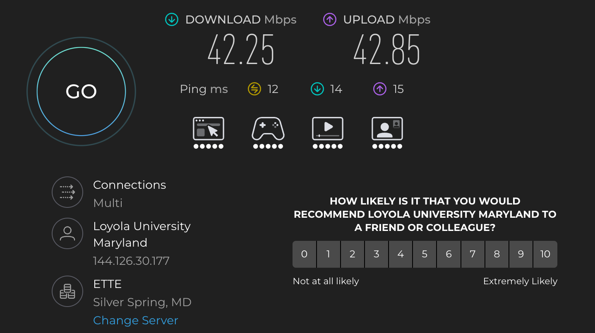


### Task 3 Evidence

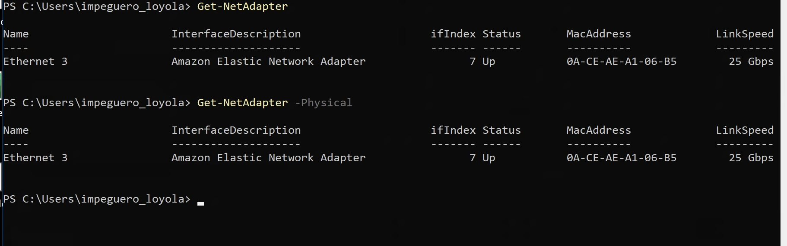

### Task 4 Evidence

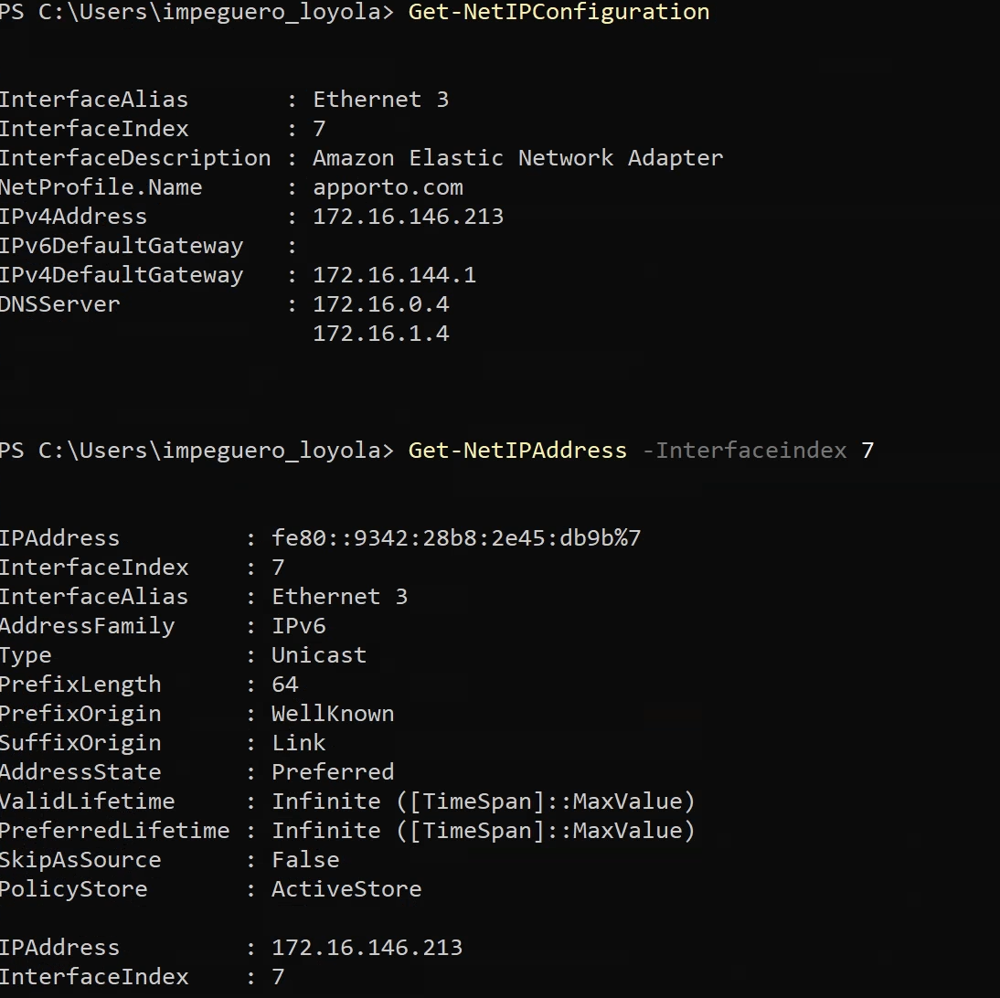
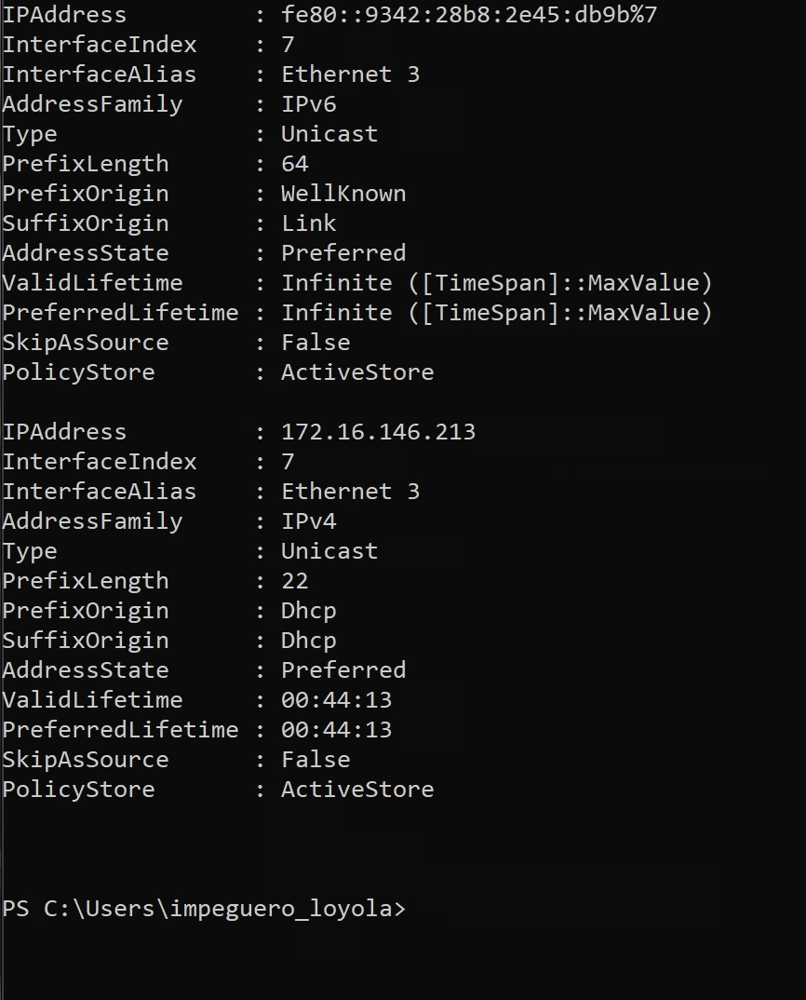


### Task 5 Evidence

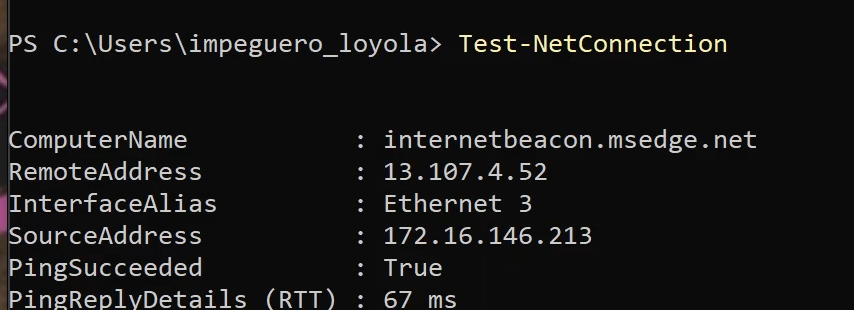
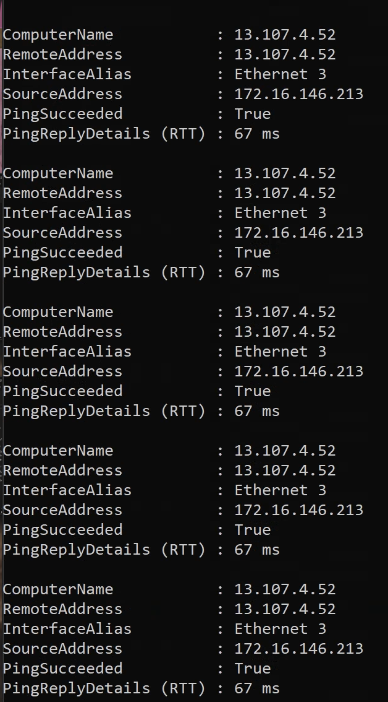
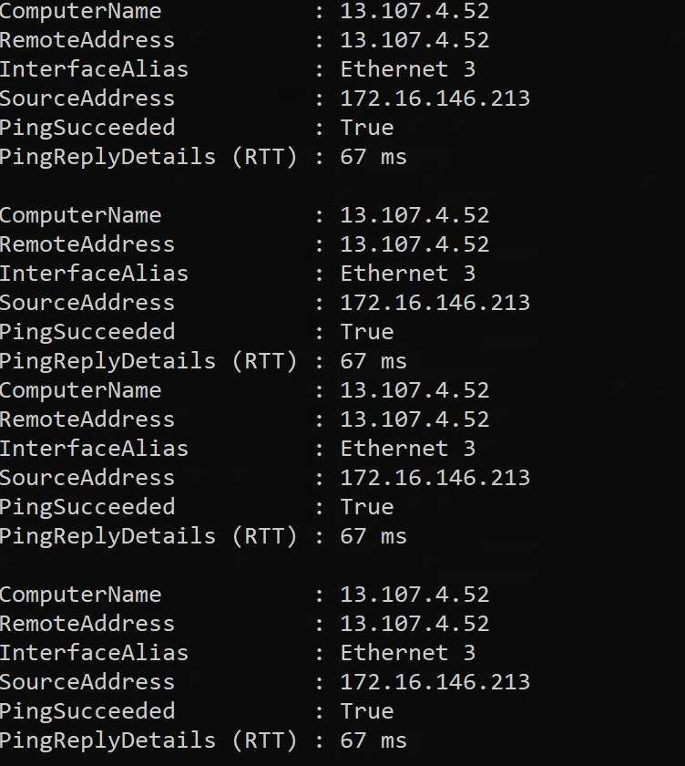
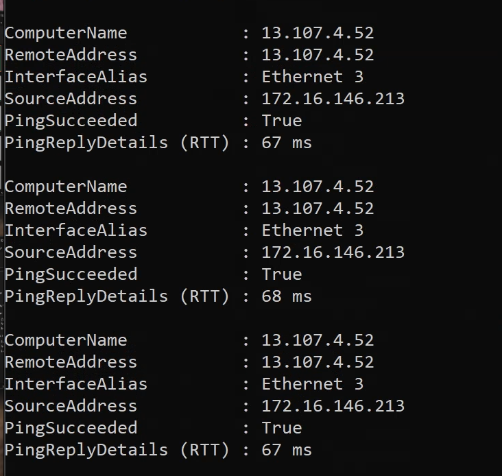

### Task 6 Evidence

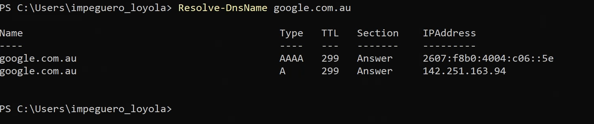

### Task 7 Evidence

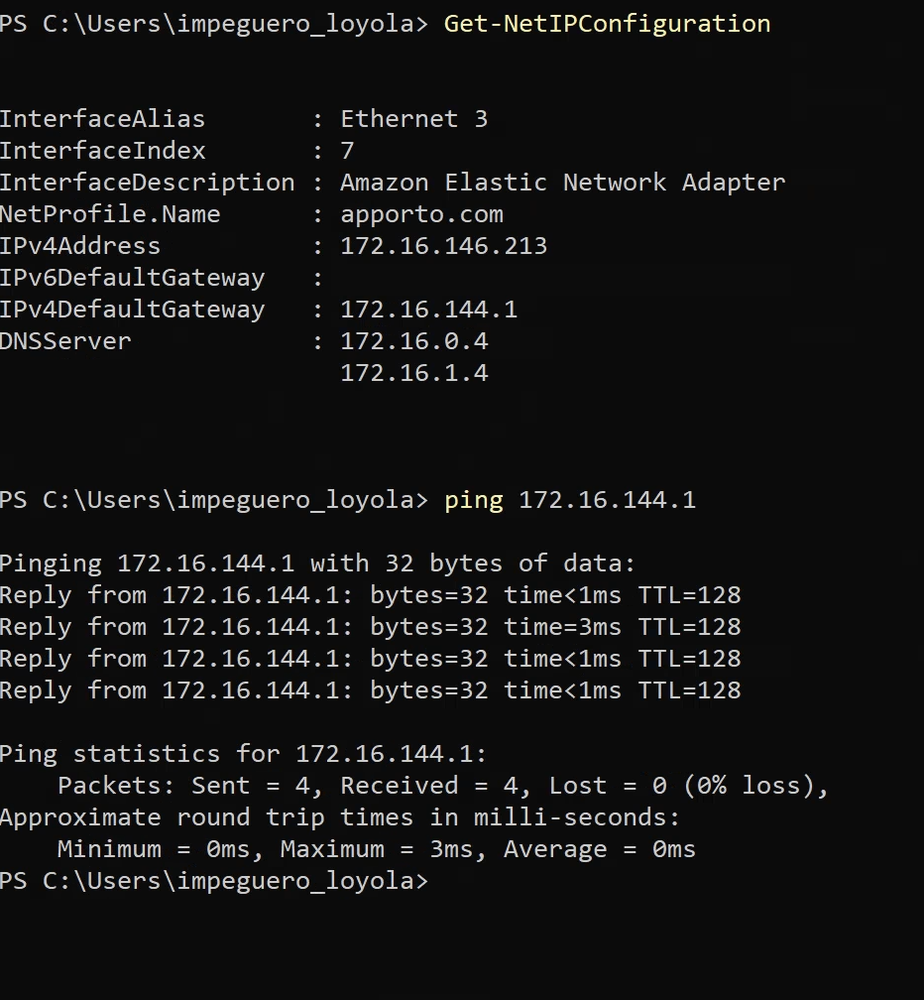

### Task 8 Evidence

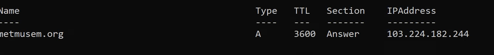


## 3. Notes & Explanations

### [Topic / Concept]

**Notes:**

* [Important information]
* [Definition]
* [Procedure]
* [Important takeaway]

**Explanation:**
[Explain what you learned in your own words.]

### [Topic / Concept]

**Notes:**

* [Important information]
* [Important information]

**Explanation:**
[Explain the concept.]

---

## 4. Project Contributions

**Project task:** N/A


---

# Week 3

## 1. Tutorial Tasks Completed

### Task 1: View ARP Table 


### Task 2: Draw Network Diagrams 


### Task 3: Learning Reflection 

---

## 2. Screenshots / Command Outputs

### Task 1 Evidence


### Task 2 Evidence


---

## 3. Notes & Explanations

### [Topic / Concept]

**Notes:**

* [Important information]
* [Important information]
* [Important information]

**Explanation:**
[Explain what you learned and how you completed the task.]

### [Topic / Concept]

**Notes:**

* [Important information]
* [Important information]

**Explanation:**
[Explain the concept in your own words.]

---

## 4. Project Contributions

**Project task:** N/A


---

# Week 4

## 1. Tutorial Tasks Completed

### Task 1: View Routing Table

### Task 2: Trace Path Through the Internet 

### Task 3:  IP Address Lookup 

### Task 4: Project Plan


---

## 2. Screenshots / Command Outputs


**Command used:**

```text
[Command]
```

**Output:**

```text
[Output]
```

---

## 3. Notes & Explanations

**Notes:**

* [Important concept]
* [Important command]
* [Important procedure]

**Explanation:**
[Explain what you learned.]

---

## 4. Project Contributions

**Project task:** [Task]

**My contribution:**
[Description]

**Evidence:**


**Result:**
[Result]

---

# Week 5

## 1. Tutorial Tasks Completed

### Task 1: View Your Cookies


### Task 2: Root Servers 

### Task 3: IP Network Design 


---

## 2. Screenshots / Command Outputs


**Command used:**

---

## 3. Notes & Explanations

**Notes:**

* [Important concept]
* [Important concept]
* [Important takeaway]

**Explanation:**
[Explain what you learned.]

---

## 4. Project Contributions

**Project task:** [Task]

**My contribution:**
[Description]

**Evidence:**


**Result:**
[Result]

---

# Week 6

## 1. Tutorial Tasks Completed

### Task 1: [Task Name]

* [Task completed]
* [Result]

### Task 2: [Task Name]

* [Task completed]
* [Result]

---

## 2. Screenshots / Command Outputs


**Command used:**

```text
[Command]
```

**Output:**

```text
[Output]
```

---

## 3. Notes & Explanations

**Notes:**

* [Important concept]
* [Important procedure]
* [Important takeaway]

**Explanation:**
[Explain what you learned.]

---

## 4. Project Contributions

**Project task:** [Task]

**My contribution:**
[Description]

**Evidence:**


**Result:**
[Result]

---

# Week 7

## 1. Tutorial Tasks Completed

### Task 1: Azure Cloud Computing


### Task 2: Analyzing Ping Packet Capture

### Task 3: Packet Structure

---

## 2. Screenshots / Command Outputs


**Command used:**

```text
[Command]
```

**Output:**

```text
[Output]
```

---

## 3. Notes & Explanations

**Notes:**

* [Important concept]
* [Important procedure]
* [Important takeaway]

**Explanation:**
[Explain what you learned.]

---

## 4. Project Contributions

**Project task:** [Task]

**My contribution:**
[Description]

**Evidence:**


**Result:**
[Result]

---

# Week 8

## 1. Tutorial Tasks Completed

### Task 1:CIA Protections

* [Task completed]
* [Result]

### Task 2: Threat Sources and Motivation

### Task 3: Explore Vulnerabilities

### Task 4: Vulnerability Disclosures

### Task 5: Find OWASP top 10 vulnerabilities

---

## 2. Screenshots / Command Outputs


**Command used:**

```text
[Command]
```

**Output:**

```text
[Output]
```

---

## 3. Notes & Explanations

**Notes:**

* [Important concept]
* [Important procedure]
* [Important takeaway]

**Explanation:**
[Explain what you learned.]

---

## 4. Project Contributions

**Project task:** [Task]

**My contribution:**
[Description]

**Evidence:**


**Result:**
[Result]

---

# Week 9

## 1. Tutorial Tasks Completed

### Task 1: Select Security Objectives


### Task 2: Create Asset Invesntory

### Task 3: Conduct a Risk Analysis


* [Task completed]
* [Result]

---

## 2. Screenshots / Command Outputs


**Command used:**

```text
[Command]
```

**Output:**

```text
[Output]
```

---

## 3. Notes & Explanations

**Notes:**

* [Important concept]
* [Important procedure]
* [Important takeaway]

**Explanation:**
[Explain what you learned.]

---

## 4. Project Contributions

**Project task:** [Task]

**My contribution:**
[Description]

**Evidence:**


**Result:**
[Result]

---

# Week 10

## 1. Tutorial Tasks Completed

### Task 1: [Task Name]

* [Task completed]
* [Result]

### Task 2: [Task Name]

* [Task completed]
* [Result]

---

## 2. Screenshots / Command Outputs


**Command used:**

```text
[Command]
```

**Output:**

```text
[Output]
```

---

## 3. Notes & Explanations

**Notes:**

* [Important concept]
* [Important procedure]
* [Important takeaway]

**Explanation:**
[Explain what you learned.]

---

## 4. Project Contributions

**Project task:** [Task]

**My contribution:**
[Description]

**Evidence:**


**Result:**
[Result]

---

# Final Reflection

## Skills Developed

* [Skill 1]
* [Skill 2]
* [Skill 3]
* [Skill 4]

## What I Learned

[Explain the most important things you learned throughout the unit.]

## Challenges

[Explain the challenges you experienced and how you solved them.]

## Project Experience

[Explain your individual contributions and what you learned from working on the project.]

## Future Use

[Explain which skills, commands, tools, or concepts you will use in future units or projects.]

---

# Week 11

## 1. Tutorial Tasks Completed

### Task 1: Feedback on Project Report 


---

## 2. Screenshots / Command Outputs


**Command used:**

```text
[Command]
```

**Output:**

```text
[Output]
```

---

## 3. Notes & Explanations

**Notes:**

* [Important concept]
* [Important procedure]
* [Important takeaway]

**Explanation:**
[Explain what you learned.]

---

## 4. Project Contributions

**Project task:** [Task]

**My contribution:**
[Description]

**Evidence:**


**Result:**
[Result]

---

# Final Reflection

## Skills Developed

* [Skill 1]
* [Skill 2]
* [Skill 3]
* [Skill 4]

## What I Learned

[Explain the most important things you learned throughout the unit.]

## Challenges

[Explain the challenges you experienced and how you solved them.]

## Project Experience

[Explain your individual contributions and what you learned from working on the project.]

## Future Use

[Explain which skills, commands, tools, or concepts you will use in future units or projects.]

---

# Week 12

## 1. Tutorial Tasks Completed

### Task 1: Nist nice self-assessment


### Task 2: Cyber Security

### Task 3: Finalize GetHub


---

## 2. Screenshots / Command Outputs


**Command used:**

```text
[Command]
```

**Output:**

```text
[Output]
```

---

## 3. Notes & Explanations

**Notes:**

* [Important concept]
* [Important procedure]
* [Important takeaway]

**Explanation:**
[Explain what you learned.]

---

## 4. Project Contributions

**Project task:** [Task]

**My contribution:**
[Description]

**Evidence:**


**Result:**
[Result]

---

# Final Reflection

## Skills Developed

* [Skill 1]
* [Skill 2]
* [Skill 3]
* [Skill 4]

## What I Learned

[Explain the most important things you learned throughout the unit.]

## Challenges

[Explain the challenges you experienced and how you solved them.]

## Project Experience

[Explain your individual contributions and what you learned from working on the project.]

## Future Use

[Explain which skills, commands, tools, or concepts you will use in future units or projects.]

