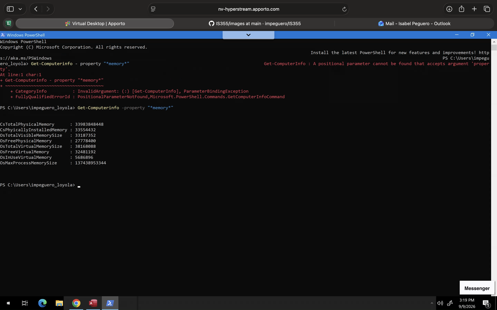

# IS355
# Tutorial & Project Journal

**Name:** Isa Peguero
---

# Week 1

## 1. Tutorial Tasks Completed

### Task 1: Start your GitHub Portfolio 


### Task 2: View Your Computer Information 


### Task 3: Timeline of 800+ operating systems, see 


---

## 2. Screenshots / Command Outputs




---

## 3. Notes & Explanations
Created a GetHub account and started my journal, I also viewed my computer information and pasted a screenshot above.

---

## 4. Project Contributions

**Project task:** N/A


---

# Week 2

## 1. Tutorial Tasks Completed

### Task 1: [Task Name]

* [What the task required]
* [What I did]
* [Result]

### Task 2: [Task Name]

* [What the task required]
* [What I did]
* [Result]

### Task 3: [Task Name]

* [What the task required]
* [What I did]
* [Result]

---

## 2. Screenshots / Command Outputs

### Task 1 Evidence


**Command used:**

```text
[Paste command here]
```

**Output:**

```text
[Paste output here]
```

### Task 2 Evidence


**Command used:**

```text
[Paste command here]
```

**Output:**

```text
[Paste output here]
```

---

## 3. Notes & Explanations

### [Topic / Concept]

**Notes:**

* [Important information]
* [Definition]
* [Procedure]
* [Important takeaway]

**Explanation:**
[Explain what you learned in your own words.]

### [Topic / Concept]

**Notes:**

* [Important information]
* [Important information]

**Explanation:**
[Explain the concept.]

---

## 4. Project Contributions

**Project task:** [Name of task]

**My contribution:**
[Describe your individual contribution.]

**What I completed:**

* [Contribution]
* [Contribution]
* [Contribution]

**Tools/software used:**

* [Tool]
* [Software]

**Evidence:**


**Result:**
[Describe the result.]

---

# Week 3

## 1. Tutorial Tasks Completed

### Task 1: [Task Name]

* [What the task required]
* [What I did]
* [Result]

### Task 2: [Task Name]

* [What the task required]
* [What I did]
* [Result]

### Task 3: [Task Name]

* [What the task required]
* [What I did]
* [Result]

---

## 2. Screenshots / Command Outputs

### Task 1 Evidence


**Command used:**

```text
[Paste command here]
```

**Output:**

```text
[Paste output here]
```

### Task 2 Evidence


**Command used:**

```text
[Paste command here]
```

**Output:**

```text
[Paste output here]
```

---

## 3. Notes & Explanations

### [Topic / Concept]

**Notes:**

* [Important information]
* [Important information]
* [Important information]

**Explanation:**
[Explain what you learned and how you completed the task.]

### [Topic / Concept]

**Notes:**

* [Important information]
* [Important information]

**Explanation:**
[Explain the concept in your own words.]

---

## 4. Project Contributions

**Project task:** [Name of task]

**My contribution:**
[Describe your contribution.]

**What I completed:**

* [Contribution]
* [Contribution]
* [Contribution]

**Evidence:**


**Result:**
[Describe the outcome.]

---

# Week 4

## 1. Tutorial Tasks Completed

### Task 1: [Task Name]

* [Task completed]
* [Result]

### Task 2: [Task Name]

* [Task completed]
* [Result]

---

## 2. Screenshots / Command Outputs


**Command used:**

```text
[Command]
```

**Output:**

```text
[Output]
```

---

## 3. Notes & Explanations

**Notes:**

* [Important concept]
* [Important command]
* [Important procedure]

**Explanation:**
[Explain what you learned.]

---

## 4. Project Contributions

**Project task:** [Task]

**My contribution:**
[Description]

**Evidence:**


**Result:**
[Result]

---

# Week 5

## 1. Tutorial Tasks Completed

### Task 1: [Task Name]

* [Task completed]
* [Result]

### Task 2: [Task Name]

* [Task completed]
* [Result]

---

## 2. Screenshots / Command Outputs


**Command used:**

```text
[Command]
```

**Output:**

```text
[Output]
```

---

## 3. Notes & Explanations

**Notes:**

* [Important concept]
* [Important concept]
* [Important takeaway]

**Explanation:**
[Explain what you learned.]

---

## 4. Project Contributions

**Project task:** [Task]

**My contribution:**
[Description]

**Evidence:**


**Result:**
[Result]

---

# Week 6

## 1. Tutorial Tasks Completed

### Task 1: [Task Name]

* [Task completed]
* [Result]

### Task 2: [Task Name]

* [Task completed]
* [Result]

---

## 2. Screenshots / Command Outputs


**Command used:**

```text
[Command]
```

**Output:**

```text
[Output]
```

---

## 3. Notes & Explanations

**Notes:**

* [Important concept]
* [Important procedure]
* [Important takeaway]

**Explanation:**
[Explain what you learned.]

---

## 4. Project Contributions

**Project task:** [Task]

**My contribution:**
[Description]

**Evidence:**


**Result:**
[Result]

---

# Week 7

## 1. Tutorial Tasks Completed

### Task 1: [Task Name]

* [Task completed]
* [Result]

### Task 2: [Task Name]

* [Task completed]
* [Result]

---

## 2. Screenshots / Command Outputs


**Command used:**

```text
[Command]
```

**Output:**

```text
[Output]
```

---

## 3. Notes & Explanations

**Notes:**

* [Important concept]
* [Important procedure]
* [Important takeaway]

**Explanation:**
[Explain what you learned.]

---

## 4. Project Contributions

**Project task:** [Task]

**My contribution:**
[Description]

**Evidence:**


**Result:**
[Result]

---

# Week 8

## 1. Tutorial Tasks Completed

### Task 1: [Task Name]

* [Task completed]
* [Result]

### Task 2: [Task Name]

* [Task completed]
* [Result]

---

## 2. Screenshots / Command Outputs


**Command used:**

```text
[Command]
```

**Output:**

```text
[Output]
```

---

## 3. Notes & Explanations

**Notes:**

* [Important concept]
* [Important procedure]
* [Important takeaway]

**Explanation:**
[Explain what you learned.]

---

## 4. Project Contributions

**Project task:** [Task]

**My contribution:**
[Description]

**Evidence:**


**Result:**
[Result]

---

# Week 9

## 1. Tutorial Tasks Completed

### Task 1: [Task Name]

* [Task completed]
* [Result]

### Task 2: [Task Name]

* [Task completed]
* [Result]

---

## 2. Screenshots / Command Outputs


**Command used:**

```text
[Command]
```

**Output:**

```text
[Output]
```

---

## 3. Notes & Explanations

**Notes:**

* [Important concept]
* [Important procedure]
* [Important takeaway]

**Explanation:**
[Explain what you learned.]

---

## 4. Project Contributions

**Project task:** [Task]

**My contribution:**
[Description]

**Evidence:**


**Result:**
[Result]

---

# Week 10

## 1. Tutorial Tasks Completed

### Task 1: [Task Name]

* [Task completed]
* [Result]

### Task 2: [Task Name]

* [Task completed]
* [Result]

---

## 2. Screenshots / Command Outputs


**Command used:**

```text
[Command]
```

**Output:**

```text
[Output]
```

---

## 3. Notes & Explanations

**Notes:**

* [Important concept]
* [Important procedure]
* [Important takeaway]

**Explanation:**
[Explain what you learned.]

---

## 4. Project Contributions

**Project task:** [Task]

**My contribution:**
[Description]

**Evidence:**


**Result:**
[Result]

---

# Final Reflection

## Skills Developed

* [Skill 1]
* [Skill 2]
* [Skill 3]
* [Skill 4]

## What I Learned

[Explain the most important things you learned throughout the unit.]

## Challenges

[Explain the challenges you experienced and how you solved them.]

## Project Experience

[Explain your individual contributions and what you learned from working on the project.]

## Future Use

[Explain which skills, commands, tools, or concepts you will use in future units or projects.]
